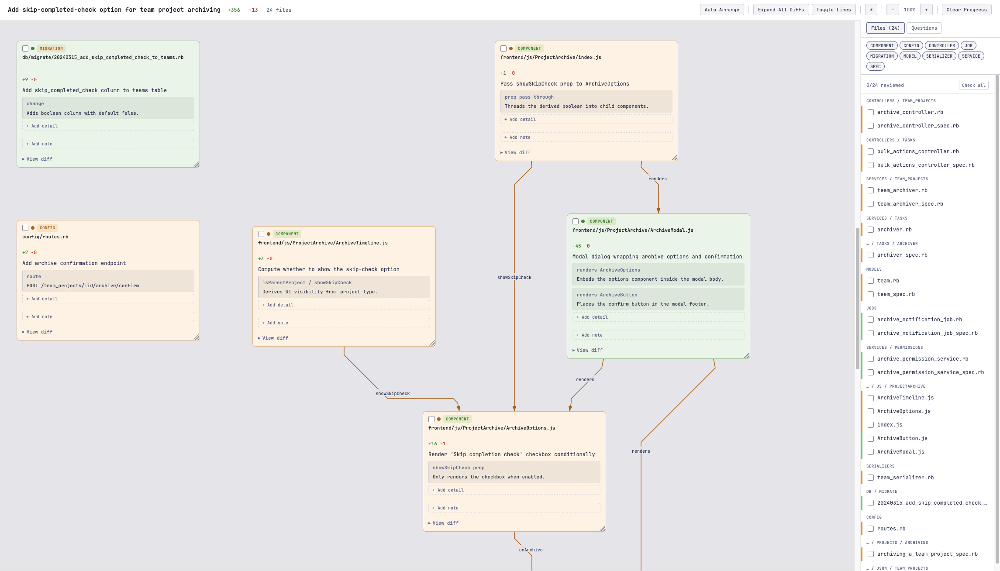

# DiffMapper

Generate interactive HTML canvases from git diffs for visual PR review. Cards per changed file, connection lines showing relationships, draggable spatial layout.



## Quick Start

```bash
gem install specific_install && gem specific_install https://github.com/imlukedewitt/diffmapper.git

diffmapper master...feature > review.html
open review.html
```

Requires Ruby >= 3.1.

## With Agent Enrichment

The canvas is useful on its own, but an LLM agent can add summaries, connections, and review annotations before rendering. Install the agent skill to teach your LLM the enrichment workflow:

```bash
diffmapper setup
```

Supports Claude Code and Pi skill directories, or specify a custom path.

## Commands

| Command | Description |
|---------|-------------|
| `diffmapper <ref>` | Parse + render to stdout (quick preview) |
| `diffmapper parse <ref>` | Parse diff ❯ JSON (`_diffmapper/data/`) |
| `diffmapper render <branch\|file>` | Render JSON ❯ HTML (`_diffmapper/`) |
| `diffmapper enrich <branch\|file> ...` | Mutate JSON in-place |
| `diffmapper setup [path]` | Install agent skill |

Add `--stdout` to `parse` or `render` for stdout output. Piped input works: `git diff | diffmapper`

## Enrichment

```bash
# Context
diffmapper enrich <branch> context --summary "..." --description "..."

# Per-file
diffmapper enrich <branch> file <id> --summary "..."
diffmapper enrich <branch> file <id> --detail "updated #perform" "Checks skip flag"
diffmapper enrich <branch> file <id> --annotation note|question "text"
diffmapper enrich <branch> file <id> --type service

# Connections
diffmapper enrich <branch> connection <from> <to> --label "calls" --type calls|renders|passes_prop|styles
```

## Canvas

Cards are editable from the UI — summaries, details, and annotations can all be added/edited/deleted without re-rendering. State persists to localStorage.

Other features: A* routed connection lines, file review checkboxes, sidebar with file list + questions tracker, type filter pills, zoom (Ctrl+scroll anchors to cursor), light/dark theme, expandable inline diffs, card resizing.

## Configuration

Optional `.diffmapper.yml` in repo root:

```yaml
output_dir: path/to/reviews
```

## Development

```bash
bundle install
bundle exec rspec          # Ruby specs (includes Capybara browser tests)
node --test spec/js/*.js   # JS unit tests
```
